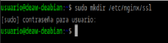
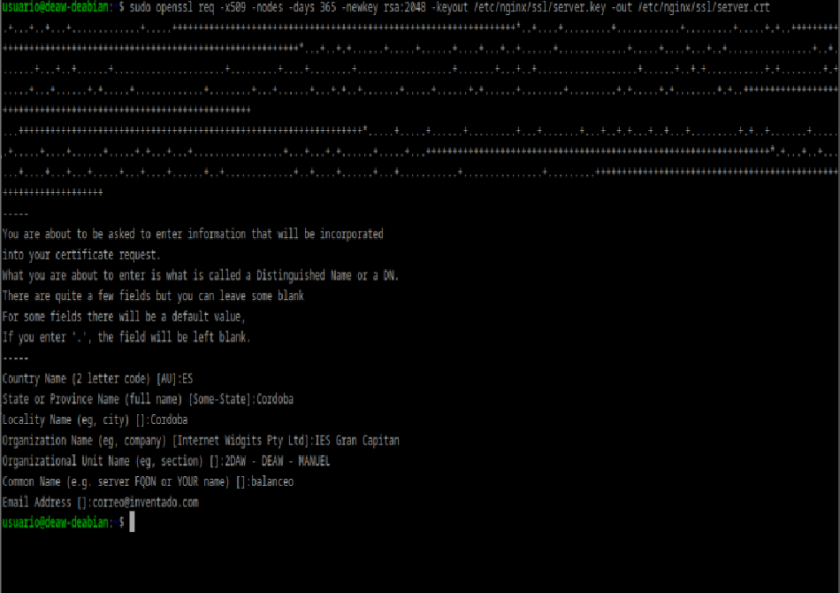
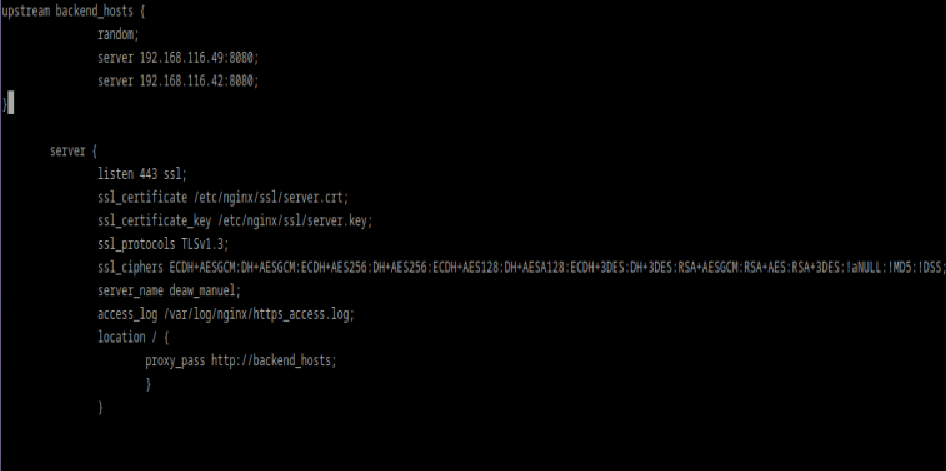
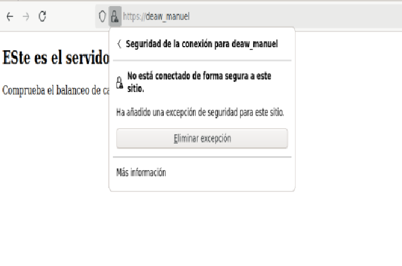
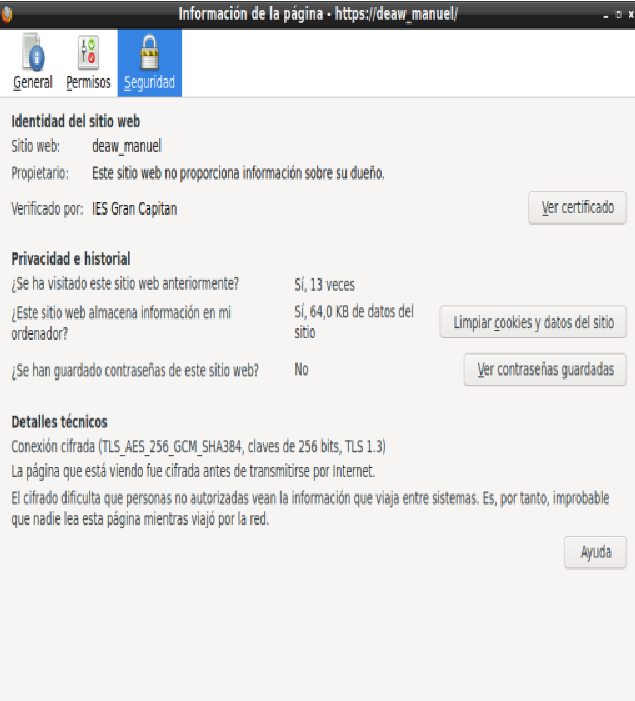
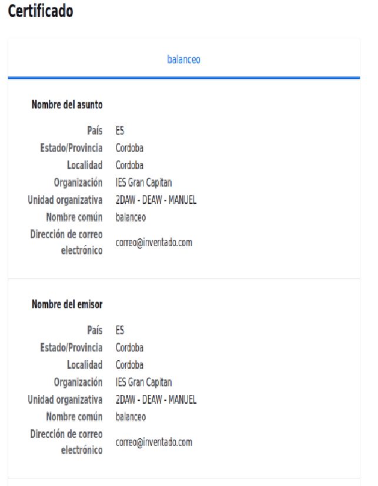
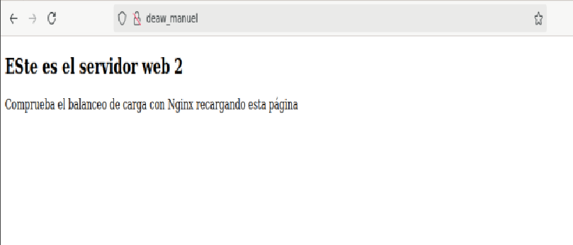
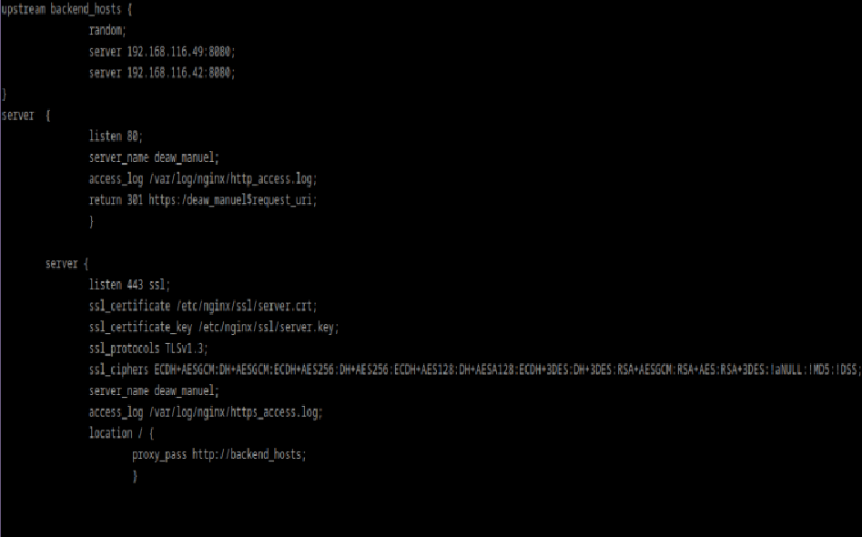
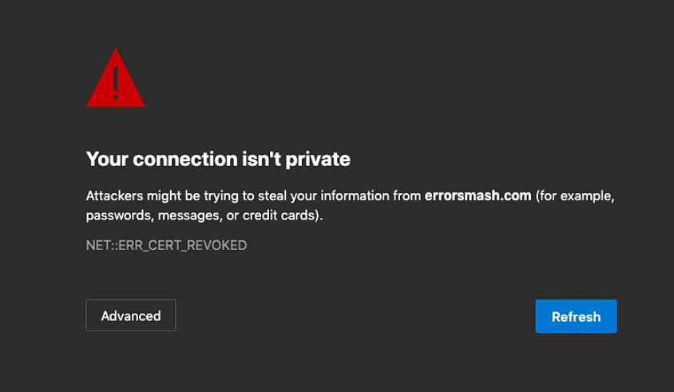

# PRÁCTICA 2.5: Proxy inverso y balanceo de carga con SSL en NGINX

## Creacíon de la clave y certificado ssl
En primer lugar crearemos el directorio donde guardaremos la clave y el certificado ssl dentro de nuestro servidor nginx:



y con el siguiente comando lo crearemos, e iremos rellenando los campos que nos pidan:



## Configuración de SSL en el proxy inverso

Nos dirigimos hacia el archivo de configuración de balanceo, creado en la práctica anterior, y añadimos las siguientes líneas:



Además hemos cambiado el puerto de escucha (anteriormente 80) a 443, que es el puerto predeterminado de HTTPS.

## Comprobaciones

Nos dirigimos hacia https:/deaw_manuel, a lo cual el navegador nos dará el siguiente aviso de seguiridad:



Si pinchamos en más información se nos abrirá la siguiente ventana:



Y presionamos sobre "Ver certificado", para ver los siguientes detalles:



Si en este momento intentamos acceder a la página mediante el protocolo http, se nos muestra la página aparentemente normal:



Pero en realidad no se está realizando el balanceo, ya que no se ha redirigido a el HTTPS, lo cual arreglaremos a continuación.

## Redirección forzosa a HTTPS

Para conseguirlo, crearemos un nuevo apartado server dentro del archivo de configuración ya mencionado, y añadiremos lo siguiente:


Nota: La imagen la tomé antes de añadir una llave al final "}" lo cuál me generaba un error.

La redirección 301 es un código o comando insertado por un Webmaster que permite redirigir a los usuarios y buscadores de un sitio web de un sitio a otro.

Es decir, lo que estamos haciendo es que cuando se reciba una petición HTTP (puerto 80) en http://balanceo, se redirija a https://balanceo (HTTPS)

## Cuestiones Finales

### Cuestión 1

Hemos configurado nuestro proxy inverso con todo lo que nos hace falta pero no nos funciona y da un error del tipo This site can't provide a secure connection, ERR_SSL_PROTOCOL_ERROR.

Dentro de nuestro server block tenemos esto:

```bash
server {
    listen 443;
    ssl_certificate /etc/nginx/ssl/enrico-berlinguer/server.crt;
    ssl_certificate_key /etc/nginx/ssl/enrico-berlinguer/server.key;
    ssl_protocols TLSv1.3;
    ssl_ciphers ECDH+AESGCM:DH+AESGCM:ECDH+AES256:DH+AES256:ECDH+AES128:DH+AES:ECDH+3DES:DH+3DES:RSA+AESGCM:RSA+AES:RSA+3DES:!aNULL:!MD5:!DSS;
    server_name enrico-berlinguer;
    access_log /var/log/nginx/https_access.log;

    location / {
        proxy_pass http://red-party;
        }
    }
```
---
Se puede deber a que no se han creado adecuadamente los certificados ssl de la web.

### Cuestión 2

Imaginad que intentamos acceder a nuestro sitio web HTTPS y nos encontramos con el siguiente error:



Investigad qué está pasando y como se ha de solucionar.

